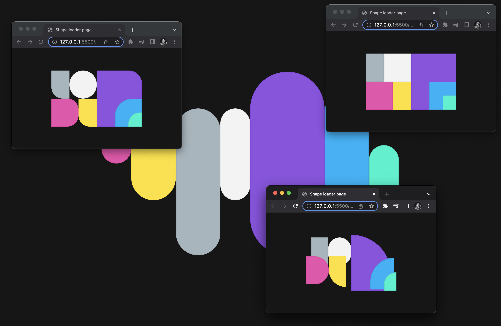

## An artful shape loader 🎨

> Loading shapes with four variant styles every 2 seconds.



Featuring:

- A single vanilla website loader with colorful shape variants.
- Making use of HTML `data` attributes toggle activation.
- Applying a animation based on a wrappers `data` attributes:

```html
<div id="wrapper" data-configuration="1" data-roundness="1">
  <div class="shape"></div>
  <div class="shape"></div>
  <div class="shape"></div>
  <div class="shape"></div>
  <div class="shape"></div>
  <div class="shape"></div>
  <div class="shape"></div>
  <div class="shape"></div>
</div>
```

- We select a random configuration & roundness per `data` combination.
- Each shape we `nth-child` then apply different position & roundness.

```css
/* layout configuration (combinations)*/
#wrapper[data-configuration="1"] > .shape:nth-child(1) {
  left: 0%;
  top: 0%;
  height: 50%;
  width: 20%;
}
#wrapper[data-configuration="1"] > .shape:nth-child(2) {
  left: 20%;
  top: 0%;
  height: 50%;
  width: 30%;
}
#wrapper[data-configuration="1"] > .shape:nth-child(3) {
  left: 50%;
  top: 0%;
  height: 100%;
  width: 50%;
}
#wrapper[data-configuration="1"] > .shape:nth-child(4) {
  left: 0%;
  top: 50%;
  height: 50%;
  width: 30%;
}
#wrapper[data-configuration="1"] > .shape:nth-child(5) {
  left: 30%;
  top: 50%;
  height: 50%;
  width: 20%;
}
#wrapper[data-configuration="1"] > .shape:nth-child(6) {
  left: 70%;
  top: 50%;
  height: 50%;
  width: 30%;
}
#wrapper[data-configuration="1"] > .shape:nth-child(7) {
  left: 85%;
  top: 75%;
  height: 25%;
  width: 15%;
}
/* roundness configuration */
#wrapper[data-roundness="1"] > .shape {
  border-radius: 6rem;
}
```

- Here we change shape combinations at an interval.
- We select a data configuration & roundness.
- The starting wrapper `dataset` configuration="1" & roundness="1".
- Randomly we switch the `data` attribute around, altering the child/shapes.
- We select random and defined pairs from the array.

```js
// Here we ensure that only valid/wanted compilations are used.
const combinations = [
  { configuration: 1, roundness: 1 },
  { configuration: 1, roundness: 2 },
  { configuration: 1, roundness: 4 },
  { configuration: 2, roundness: 2 },
  { configuration: 2, roundness: 3 },
  { configuration: 3, roundness: 3 },
];

setInterval(() => {
  let currentCombo;
  const index = rand(0, combinations.length - 1);
  currentCombo = combinations[index];
  // Instead of selecting random values, we rather select random pairs:
  // console.log(currentCombo); // We use random and valid compilations :)
  // wrapper.dataset.configuration = rand(1, 3) // ❌
  // wrapper.dataset.roundness = rand(1, 4) // ❌
  wrapper.dataset.configuration = currentCombo.configuration;
  wrapper.dataset.roundness = currentCombo.roundness;
}, 2000);
```

Regards, <br />
Luigi Lupini <br />
<br />
I ❤️ all things (🇮🇹 / 🛵 / ☕️ / 👨‍👩‍👧)<br />
